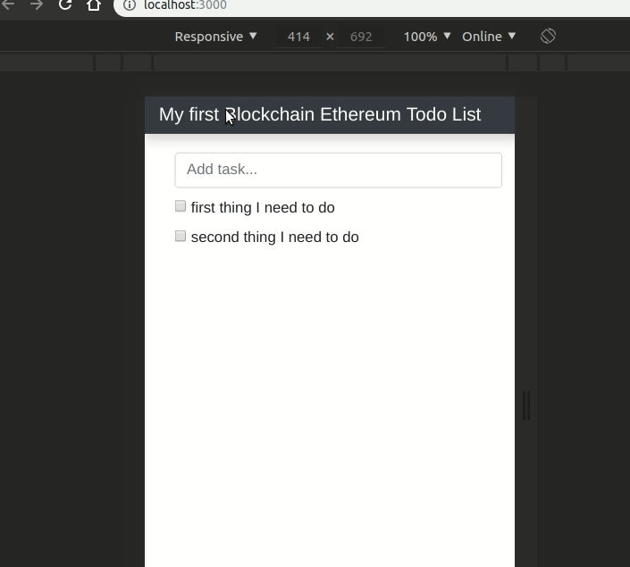

# Simple Ethereum TodoList

I've used Dapp University's tutorial to build this.

**Required:**
* Ganache (download app)
* Metamask (install chrome extension)
* Truffle (npm install)

## run
* start your Ganache app
* `npm install`
* `truffle migrate`
* `npm run dev`
